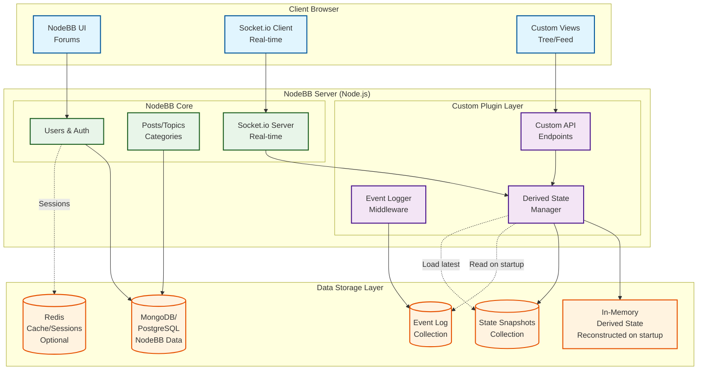

# NodeBB Implementation Design

## Overview

This document describes the complete system architecture for implementing a political discussion synthesis platform using NodeBB as the core forum engine, with event sourcing for derived state management and custom UI components for structured debate.

## System Architecture

### Overview Diagram



## Core Design Principles

### 1. Event Sourcing Architecture
- All user actions are stored as immutable events in a change log
- System state is derived by replaying events from the log
- Snapshots are taken periodically to speed up recovery

### 2. NodeBB as Foundation
- Leverage NodeBB's existing user management, authentication, and permissions
- Use NodeBB's post system for content storage
- Extend via plugin architecture rather than forking

### 3. Derived State Management
- Compute aggregations (vote counts, scores, tribal breakdowns) in memory
- Rebuild state on server restart from event log + latest snapshot
- Push updates to clients via Socket.io

## Data Model Mapping

### NodeBB Entities → Forum Concepts

```javascript
// NodeBB User → Forum Participant
{
  uid: 123,                    // NodeBB user ID
  username: "user123",
  customFields: {
    tribes: ["progressive", "environmental"],  // Political affiliations
    invitation_status: "accepted"
  }
}

// NodeBB Post → Forum Note
{
  pid: 456,                    // NodeBB post ID → note_id
  tid: 789,                    // Topic ID → parent context
  uid: 123,                    // Author
  content: "Post content",     // Note content
  customData: {
    note_type: "contribution",
    stance: "support",         // support/oppose/none
    subtype: "assertion",       // comment/assertion/reference/subclaim
    short_name: "Single Payer"
  }
}
```

## Event Sourcing Implementation

### Event Log Structure

```javascript
// Events stored in MongoDB/PostgreSQL collection: 'event_log'
{
  _id: "evt_1234567890",
  timestamp: 1704067200000,
  event_type: "NOTE_CREATED",      // NOTE_CREATED, STANCE_CHANGED, etc.
  actor_id: "user_123",
  payload: {
    note_id: "note_456",
    parent_id: "note_789",
    note_type: "contribution",
    stance: "support",
    subtype: "assertion",
    content: "Medicare for all would reduce costs..."
  },
  metadata: {
    ip: "192.168.1.1",
    user_agent: "Mozilla/5.0...",
    session_id: "sess_abc123"
  }
}
```

### Event Types

```javascript
const EventTypes = {
  // Note Events
  NOTE_CREATED: 'NOTE_CREATED',
  NOTE_EDITED: 'NOTE_EDITED',
  NOTE_DELETED: 'NOTE_DELETED',
  
  // Stance Events  
  STANCE_CHANGED: 'STANCE_CHANGED',
  SUPPORT_TOGGLED: 'SUPPORT_TOGGLED',
  OPPOSE_TOGGLED: 'OPPOSE_TOGGLED',
  
  // User Events
  USER_JOINED: 'USER_JOINED',
  TRIBE_CHANGED: 'TRIBE_CHANGED',
  
  // Moderation Events
  NOTE_FLAGGED: 'NOTE_FLAGGED',
  NOTE_APPROVED: 'NOTE_APPROVED'
};
```

### State Reconstruction

```javascript
class DerivedStateManager {
  constructor() {
    this.state = {
      notes: {},        // noteId → aggregated data
      users: {},        // userId → user statistics
      trending: [],     // array of trending noteIds
      tribal: {}        // tribal breakdowns
    };
  }
  
  async initialize() {
    // Load latest snapshot
    const snapshot = await db.collection('state_snapshots')
      .findOne({}, {sort: {timestamp: -1}});
    
    if (snapshot) {
      this.state = snapshot.state;
      const lastEventTime = snapshot.timestamp;
      
      // Replay events since snapshot
      const events = await db.collection('event_log')
        .find({timestamp: {$gt: lastEventTime}})
        .sort({timestamp: 1})
        .toArray();
        
      for (const event of events) {
        this.applyEvent(event);
      }
    } else {
      // Full rebuild from beginning
      await this.rebuildFromScratch();
    }
  }
  
  applyEvent(event) {
    switch(event.event_type) {
      case 'SUPPORT_TOGGLED':
        const note = this.state.notes[event.payload.note_id] || {};
        if (event.payload.added) {
          note.support_count = (note.support_count || 0) + 1;
          note.support_users = [...(note.support_users || []), event.actor_id];
        } else {
          note.support_count = Math.max(0, (note.support_count || 0) - 1);
          note.support_users = (note.support_users || [])
            .filter(id => id !== event.actor_id);
        }
        this.state.notes[event.payload.note_id] = note;
        break;
        
      // ... other event handlers
    }
  }
  
  async snapshot() {
    await db.collection('state_snapshots').insertOne({
      timestamp: Date.now(),
      state: this.state,
      event_count: await db.collection('event_log').countDocuments()
    });
    
    // Keep only last 3 snapshots
    const old = await db.collection('state_snapshots')
      .find()
      .sort({timestamp: -1})
      .skip(3)
      .toArray();
      
    if (old.length > 0) {
      await db.collection('state_snapshots')
        .deleteMany({_id: {$in: old.map(s => s._id)}});
    }
  }
}
```

## NodeBB Plugin Architecture

### Plugin Structure

```
nodebb-plugin-political-forum/
├── library.js           # Main plugin file
├── package.json
├── plugin.json          # NodeBB plugin manifest
├── lib/
│   ├── eventLogger.js   # Event logging middleware
│   ├── stateManager.js  # Derived state management
│   ├── customRoutes.js  # API endpoints
│   └── socketHandlers.js # Real-time handlers
├── static/
│   ├── js/
│   │   ├── client.js    # Client-side logic
│   │   └── treeView.js  # Custom visualizations
│   └── templates/
│       ├── nodeViewer.tpl
│       └── feedView.tpl
└── scss/
    └── styles.scss
```

### Plugin Manifest (plugin.json)

```json
{
  "id": "nodebb-plugin-political-forum",
  "name": "Political Forum Extensions",
  "hooks": [
    {
      "hook": "static:app.load", 
      "method": "init"
    },
    {
      "hook": "filter:post.save",
      "method": "logPostEvent"
    },
    {
      "hook": "action:post.upvote",
      "method": "logVoteEvent"
    },
    {
      "hook": "filter:user.customFields",
      "method": "addTribalFields"
    }
  ],
  "staticDirs": {
    "static": "./static"
  },
  "scss": [
    "./scss/styles.scss"
  ]
}
```

### Middleware Integration

```javascript
// library.js - Main plugin file
const stateManager = require('./lib/stateManager');
const eventLogger = require('./lib/eventLogger');

const plugin = {};

plugin.init = async (params) => {
  const {app, middleware} = params;
  
  // Initialize derived state manager
  await stateManager.initialize();
  
  // Add custom routes
  app.get('/api/notes/:noteId/state', async (req, res) => {
    const state = stateManager.getNoteState(req.params.noteId);
    res.json(state);
  });
  
  // Socket.io handlers
  const io = require.main.require('./src/socket.io');
  io.on('connection', (socket) => {
    socket.on('note.toggleSupport', async (data) => {
      await eventLogger.log({
        event_type: 'SUPPORT_TOGGLED',
        actor_id: socket.uid,
        payload: data
      });
      
      stateManager.applyEvent(/* ... */);
      
      // Broadcast update
      io.to(`note_${data.noteId}`).emit('state.updated', {
        noteId: data.noteId,
        state: stateManager.getNoteState(data.noteId)
      });
    });
  });
};

// Hook into NodeBB post creation
plugin.logPostEvent = async (postData) => {
  await eventLogger.log({
    event_type: 'NOTE_CREATED',
    actor_id: postData.uid,
    payload: {
      note_id: postData.pid,
      content: postData.content,
      // ... extract custom fields
    }
  });
  
  return postData;
};

module.exports = plugin;
```

## Custom Views and UI

### Node Viewer Component

```javascript
// static/js/treeView.js
class NoteTreeView {
  constructor(rootNoteId) {
    this.rootNoteId = rootNoteId;
    this.socket = socket;
    this.bindEvents();
  }
  
  bindEvents() {
    // Real-time updates
    this.socket.on('state.updated', (data) => {
      if (data.noteId in this.visibleNotes) {
        this.updateNoteDisplay(data.noteId, data.state);
      }
    });
    
    // User actions
    document.querySelectorAll('.support-btn').forEach(btn => {
      btn.addEventListener('click', (e) => {
        const noteId = e.target.dataset.noteId;
        this.socket.emit('note.toggleSupport', {noteId});
      });
    });
  }
  
  updateNoteDisplay(noteId, state) {
    const elem = document.querySelector(`[data-note-id="${noteId}"]`);
    elem.querySelector('.support-count').textContent = state.support_count;
    elem.querySelector('.oppose-count').textContent = state.oppose_count;
    
    // Update tribal breakdown
    const breakdown = elem.querySelector('.tribal-breakdown');
    breakdown.innerHTML = this.renderTribalBreakdown(state.tribal);
  }
}
```

### Custom Templates

```handlebars
<!-- templates/nodeViewer.tpl -->
<div class="note-viewer" data-note-id="{note.id}">
  <div class="note-header">
    <nav class="breadcrumbs">
      {{{ each breadcrumbs }}}
        <a href="/note/{@value.id}">{@value.short_name}</a>
        {{#unless @last}}>{{/unless}}
      {{{ /each }}}
    </nav>
    
    <div class="note-actions">
      <button class="support-btn" data-note-id="{note.id}">
        👍 <span class="support-count">{note.support_count}</span>
      </button>
      <button class="oppose-btn" data-note-id="{note.id}">
        👎 <span class="oppose-count">{note.oppose_count}</span>
      </button>
      <button class="add-menu-btn">➕</button>
    </div>
  </div>
  
  <h1 class="note-title">{note.title}</h1>
  
  <div class="note-metadata">
    <a href="/user/{note.author.username}">@{note.author.username}</a>
    <span class="tribes">({note.author.tribes})</span>
    <span class="timestamp">{note.relative_time}</span>
    <span class="score">⭐ {note.quality_score}</span>
    <span class="tribal-indicator">{{{ renderTribalIndicator note.tribal }}}</span>
  </div>
  
  <div class="note-content">
    {{{ note.content }}}
  </div>
  
  <div class="contributions">
    {{{ each contributions }}}
      {{{ import ./contribution.tpl }}}
    {{{ /each }}}
  </div>
</div>
```

## Deployment Architecture

### Infrastructure Requirements

```yaml
# docker-compose.yml
version: '3.8'

services:
  nodebb:
    image: nodebb/docker:latest
    environment:
      - DATABASE_TYPE=mongo
      - DATABASE_HOST=mongodb
      - REDIS_HOST=redis
    volumes:
      - ./plugin:/usr/src/app/node_modules/nodebb-plugin-political-forum
      - ./uploads:/usr/src/app/public/uploads
    ports:
      - "4567:4567"
    depends_on:
      - mongodb
      - redis
  
  mongodb:
    image: mongo:5
    volumes:
      - mongo_data:/data/db
    environment:
      - MONGO_INITDB_DATABASE=nodebb
  
  redis:
    image: redis:alpine
    volumes:
      - redis_data:/data
  
  nginx:
    image: nginx:alpine
    ports:
      - "80:80"
      - "443:443"
    volumes:
      - ./nginx.conf:/etc/nginx/nginx.conf
      - ./ssl:/etc/nginx/ssl

volumes:
  mongo_data:
  redis_data:
```

### Server Specifications

**Minimum (MVP - 100 users):**
- EC2 t3.small or equivalent
- 2 vCPU, 2GB RAM
- 20GB SSD storage
- Estimated cost: $15-20/month

**Recommended (Production):**
- EC2 t3.medium
- 2 vCPU, 4GB RAM  
- 50GB SSD storage
- CloudFront CDN for static assets
- Estimated cost: $40-50/month

### Performance Characteristics

**Event Processing:**
- Event logging: ~1ms per event
- State update: ~0.1ms per event
- Full state rebuild (10,000 events): ~1-2 seconds
- Snapshot save/load: ~100ms

**Memory Usage:**
- NodeBB core: ~200MB
- Derived state (1000 notes): ~10MB
- Event buffer: ~5MB
- Total: ~250-300MB

**Scalability Limits (Single Server):**
- Concurrent users: 200-500
- Total notes: 50,000
- Events per second: 100
- WebSocket connections: 1,000

## API Endpoints

### Custom REST API

```javascript
// Get aggregated note state
GET /api/notes/:noteId/state
Response: {
  support_count: 42,
  oppose_count: 15,
  tribal_breakdown: {...},
  quality_score: 0.73
}

// Get user's stance on a note
GET /api/notes/:noteId/stance/:userId
Response: {
  stance: "support",
  contribution_id: "note_789"
}

// Get trending notes
GET /api/trending
Response: {
  notes: [
    {note_id: "123", score: 98, title: "..."},
    // ...
  ]
}

// Get tribal breakdown for topic
GET /api/topics/:topicId/tribal
Response: {
  progressive: {support: 234, oppose: 56},
  conservative: {support: 123, oppose: 189}
}
```

### Socket.io Events

```javascript
// Client → Server
socket.emit('note.toggleSupport', {noteId: '123'});
socket.emit('note.toggleOppose', {noteId: '123'});
socket.emit('note.addContribution', {
  parentId: '123',
  stance: 'support',
  subtype: 'assertion',
  content: '...'
});

// Server → Client  
socket.on('state.updated', (data) => {
  // Real-time state updates for a note
  console.log(data.noteId, data.state);
});

socket.on('contribution.added', (data) => {
  // New contribution added to note
  console.log(data.contribution);
});
```

## Security Considerations

### Authentication & Authorization
- Leverage NodeBB's built-in authentication
- Custom permissions for tribal-specific actions
- Rate limiting on API endpoints

### Data Validation
- Sanitize all user input via NodeBB's sanitizer
- Validate event payloads before processing
- Enforce contribution limits per user

### Event Log Security
- Immutable append-only log
- Include actor ID and metadata for audit trail
- Regular backups of event log and snapshots

## Development Workflow

### Local Development

```bash
# Clone NodeBB
git clone https://github.com/NodeBB/NodeBB.git
cd NodeBB

# Install dependencies
npm install

# Link plugin for development
npm link ../nodebb-plugin-political-forum

# Start in development mode
./nodebb dev
```

### Testing Strategy

```javascript
// Test event processing
describe('Event Processing', () => {
  it('should update support count', async () => {
    const event = {
      event_type: 'SUPPORT_TOGGLED',
      payload: {note_id: '123', added: true}
    };
    
    stateManager.applyEvent(event);
    const state = stateManager.getNoteState('123');
    expect(state.support_count).toBe(1);
  });
});

// Test state reconstruction
describe('State Reconstruction', () => {
  it('should rebuild from event log', async () => {
    await stateManager.rebuildFromScratch();
    expect(stateManager.state.notes).toBeDefined();
  });
});
```

## Migration Path

### Phase 1: Core Forum (Week 1-2)
- Install and configure NodeBB
- Set up user authentication
- Configure categories for topics
- Add tribal affiliation fields

### Phase 2: Event System (Week 3-4)  
- Implement event logging middleware
- Build derived state manager
- Add snapshot functionality
- Test state reconstruction

### Phase 3: Custom UI (Week 5-6)
- Create note viewer template
- Build tree visualization
- Add real-time updates
- Implement action buttons

### Phase 4: Polish (Week 7-8)
- Performance optimization
- Add moderation tools
- Implement analytics
- User testing and refinement

## Monitoring and Maintenance

### Key Metrics to Track
- Event processing latency
- State reconstruction time
- Memory usage trends
- Socket.io connection count
- API response times

### Maintenance Tasks
- Daily: Monitor error logs
- Weekly: Review event log growth
- Monthly: Analyze usage patterns
- Quarterly: Prune old snapshots

### Backup Strategy
- Continuous: Event log replication
- Daily: Full database backup
- Weekly: Snapshot archive
- Monthly: Full system backup

## Conclusion

This design leverages NodeBB's robust forum infrastructure while adding a lightweight event-sourced layer for political discussion features. The architecture supports real-time collaboration, maintains complete audit trails, and can scale from MVP to production without major restructuring.