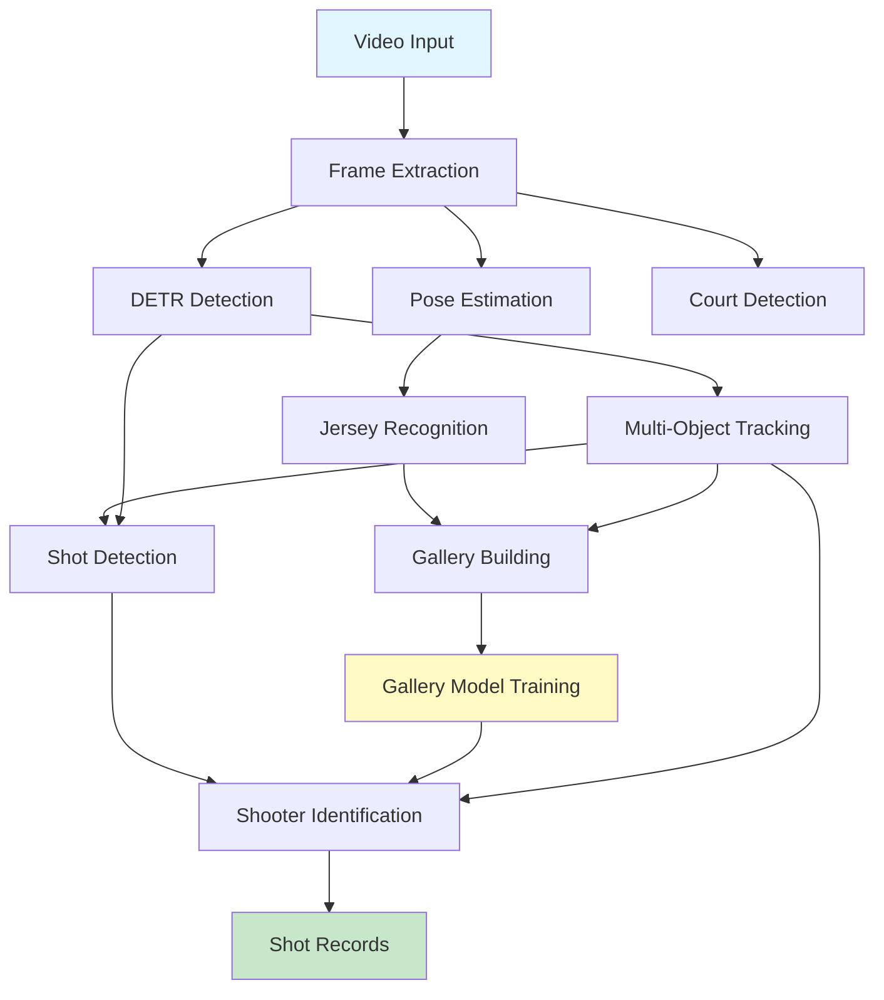
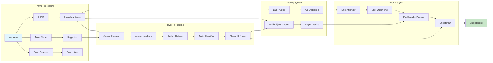

# ALG2 System - Game Processing Pipeline

## System Overview
Comprehensive basketball game analysis pipeline that tracks players, balls, and game events to produce detailed shot records with shooter identification.

## Architecture Diagrams

### High-Level Data Flow


### Detailed Processing Pipeline


## Core Detection Components

### Object Detectors
- **DETR**: Primary object detection model
  - Detects: Players, balls, backboards
  - Operates on: Individual frames
  - Output: Bounding boxes with class labels

### Court Analysis
- **Court boundary detection**: Identifies court lines and boundaries
- **Zone classification**: 2-point, 3-point, free-throw areas

### Player Analysis
- **Pose estimation**: Skeletal keypoints for each player
- **Player state detection**:
  - In-bounds vs out-of-bounds
  - Standing vs sitting
  - Active vs bench
- **Jersey number recognition**:
  - Uses pose to identify torso region
  - Specialized classifier for left/right digit recognition
  - High confidence when player is clearly visible

## Tracking Components

### Multi-Object Tracking
- **Player tracker**: Maintains consistent player IDs across frames
  - Handles occlusions and crossovers
  - Can lose players for multiple frames in crowds
- **Ball tracker**: Follows ball trajectory
  - Critical for shot detection
  - Captures arc trajectory

### Track Management
- **Track creation**: New detections spawn tracks
- **Track association**: Links detections to existing tracks
- **Track termination**: Removes lost/exited objects

## Gallery-Based Player Recognition

### Gallery Building
1. **Initial labeling**: Use jersey number detections for ground truth
2. **Track selection**: Find non-overlapping, high-confidence tracks
3. **Data expansion**: Use clean tracks to expand training set
4. **Per-player dataset**: ~1000 still images per player/referee

### Gallery Model
- **Training**: Supervised learning on game-specific player appearances
- **Features learned**: Player-specific visual characteristics
  - Face (when visible)
  - Body type/proportions
  - Gait/movement patterns
  - Uniform variations
- **Output**: Player ID probabilities for any detection

## Shot Analysis Pipeline

### Shot Detection
- **Ball tracking**: Monitors ball trajectory
- **Arc detection**: Identifies parabolic flight paths
- **Shot attempt classification**: Determines if arc is a shot
- **Shot origin**: Pixel location and frame where shot initiated
  - Sometimes captures ball in hand
  - Sometimes starts tracking after release

### Shooter Identification
- **Candidate selection**: Players near shot origin
- **Track association**: Links shot to player tracks
- **Gallery model inference**: Uses player recognition for ID
- **Confidence scoring**: Evaluates identification reliability

## Output: Shot Records

Each shot record contains:
- **Shooter ID**: Jersey number of shooting player
- **Shot result**: Make or miss
- **Shot type**: 2-pointer, 3-pointer, or free throw
- **Shot origin**: (x, y) pixel coordinates
- **Shot frame**: Frame number of shot initiation
- **Shooter bbox**: Bounding box of shooter at shot time
- **Confidence scores**: Reliability metrics for each field

## Data Flow

```
Video Frames
    ↓
DETR Detection → Objects (players, ball, backboard)
    ↓
Pose Estimation → Player keypoints
    ↓
Jersey Recognition → Initial player IDs
    ↓
Multi-Object Tracking → Consistent tracks
    ↓
Gallery Building → Player-specific training data
    ↓
Gallery Model Training → Robust player recognition
    ↓
Shot Detection (via ball arc) → Shot attempts
    ↓
Shooter ID (gallery model + tracks) → Shot attribution
    ↓
Shot Records (final output)
```

## Key Challenges

1. **Occlusion handling**: Players block each other frequently
2. **Track mixing**: Tracks can swap IDs in crowds
3. **Jersey visibility**: Numbers often obscured at shot time
4. **Temporal gaps**: Need to associate IDs across time gaps
5. **Real-time requirements**: Processing speed constraints

## Integration Points for Improvements

### Potential VideoMAE Applications
1. **Track continuity verification**: Confirm same player through occlusions
2. **Temporal jersey recognition**: Use video context vs single frames
3. **Shot biomechanics**: Identify shooter by shooting motion
4. **Gallery enhancement**: Add video features to still image gallery