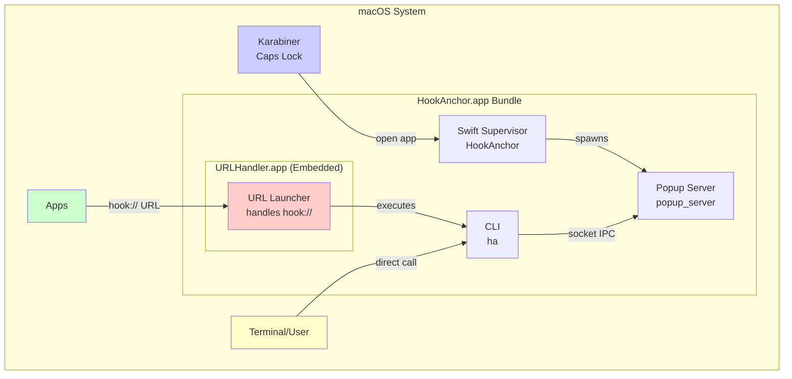

# HookAnchor System Architecture

## System Components

### Process Architecture

The system uses a multi-component architecture with separate URL handling:



### Component Roles

1. **Swift Supervisor (HookAnchor)**
   - Handles macOS lifecycle events
   - Responds to Caps Lock triggers via Karabiner
   - Manages popup_server process
   - NO URL handling (critical for stability)

2. **Popup Server**
   - Displays the egui-based GUI
   - Processes user input and search
   - Executes selected commands
   - Hidden/shown via socket commands

3. **URL Handler (URLHandler.app)** ⚠️ CRITICAL COMPONENT
   - Separate embedded app bundle
   - Registers hook:// URL scheme
   - Receives URLs via Apple Events
   - Executes `ha --hook` and exits immediately
   - NEVER shows GUI (prevents app hangs)

4. **CLI (ha)**
   - Command-line interface
   - Handles --hook option for URL processing
   - Can trigger popup via socket
   - Executes commands directly

## Component Communication

### Inter-Process Communication

1. **Swift Supervisor → Popup Server**
   - Method: Process spawning via `Process()` API on first launch only
   - Lifecycle: Supervisor starts popup_server once, it runs indefinitely
   - Monitoring: NONE - no continuous health checks or timers
   - Recovery: Only restarts if user explicitly requests show and popup isn't running

2. **Unix Domain Socket** (`/tmp/hookanchor_popup.sock`)
   - Protocol: Simple text commands
   - Commands: 
     - `show`: Display the popup window (primary command)
     - `hide`: Hide the popup window (rarely used - ESC handled internally)
     - `ping`: Connectivity check
   - Used by:
     - Swift Supervisor (sends show commands on activation)
     - CLI dispatcher (sends commands)
     - Any external tool

3. **Visibility Control Architecture**
   - **Supervisor Role**: Sends "show" command via socket when activated
   - **Popup Server Role**: Controls actual visibility using egui ViewportCommands
   - **Hide**: Popup handles ESC internally → `ViewportCommand::Visible(false)`
   - **Show**: Supervisor sends "show" → Popup calls `ViewportCommand::Visible(true)`
   - **Why Hybrid**: Popup can hide instantly on ESC without IPC latency
   - **Process State**: Popup process continues running even when window is hidden

### Data Flow

#### Popup Activation Flow (Caps Lock)
```
User presses Caps Lock → Karabiner → open /Applications/HookAnchor.app → Swift Supervisor
    → Send "show" command to popup socket → Popup Server processes command
    → Sets ViewportCommand::Visible(true) → Window becomes visible
```

#### URL Handling Flow (hook:// URLs)
```
User clicks hook://cnnp in app → macOS → URLHandler.app → Receive Apple Event
    → Execute: ha --hook "hook://cnnp" → Exit immediately (< 100ms)
    → App continues normally (no blocking, no popup shown)
```

#### Critical Separation
- **Caps Lock trigger** → Main app → Shows popup ✅
- **URL trigger** → URL handler → No popup, just executes ✅
- **NEVER**: URL → Main app → Popup (causes hangs) ❌

## File System Structure (Distribution)

When distributed to end users, HookAnchor installs the following files:

```
/
├── Applications/
│   └── HookAnchor.app/
│       └── Contents/
│           ├── MacOS/
│           │   ├── HookAnchor       # Swift supervisor binary
│           │   ├── popup_server     # Rust GUI binary
│           │   └── ha              # CLI tool
│           ├── Resources/
│           │   ├── AppIcon.icns     # Application icon
│           │   └── URLHandler.app/  # Embedded URL handler app
│           │       └── Contents/
│           │           ├── Info.plist  # Registers hook:// scheme
│           │           └── MacOS/
│           │               └── url_launcher  # Minimal URL processor
│           └── Info.plist           # App bundle metadata (NO URL registration!)
│
├── Users/[username]/
│   └── .config/
│       └── hookanchor/              # Configuration directory
│           ├── config.yaml          # User configuration
│           ├── commands.txt         # Command database
│           ├── anchor.log           # Application log
│           ├── state.json           # Window state
│           └── backups/             # Command backups
│               └── commands_*.txt
│
└── private/tmp/                     # Runtime files
    └── hookanchor_popup.sock        # Unix domain socket for IPC
```

### Installation Locations

- **Application Bundle**: `/Applications/HookAnchor.app` - Standard macOS application location
- **User Configuration**: `~/.config/hookanchor/` - User-specific settings and data
- **Runtime Socket**: `/tmp/hookanchor_popup.sock` - Temporary IPC socket (created at runtime)
- **Command Socket**: `~/.config/hookanchor/command_server.sock` - Command server socket

## Startup Sequence

### First Launch (App Not Running)

```
1. User double-clicks HookAnchor.app or presses Caps Lock
   ↓
2. macOS launches /Applications/HookAnchor.app
   ├── Starts Swift Supervisor (HookAnchor)
   ├── Sets up as LSUIElement (no dock icon)
   └── Triggers applicationDidFinishLaunching
   ↓
3. Supervisor spawns popup_server with showOnStart: true
   ├── Sets RUST_BACKTRACE=1
   ├── Passes no arguments (server mode)
   └── Stores PID for reference
   ↓
4. popup_server initializes
   ├── Loads config from ~/.config/hookanchor/config.yaml
   ├── Creates Unix socket at /tmp/hookanchor_popup.sock
   ├── Initializes egui window (initially hidden)
   ├── Starts scanner for file system indexing
   └── Begins event loop
   ↓
5. After 1 second delay, Supervisor sends "show" command
   ├── Connects to Unix socket
   ├── Sends "show\n"
   ├── popup_server calls ViewportCommand::Visible(true) + Focus
   └── Window appears to user
```

### Subsequent Activations (App Already Running)

```
1. User double-clicks HookAnchor.app or presses Caps Lock
   ↓
2. macOS activates existing Swift Supervisor
   ├── Triggers applicationDidBecomeActive
   └── Checks if popup_server is running
   ↓
3. Supervisor immediately sends "show" command
   ├── Connects to Unix socket
   ├── Sends "show\n"
   └── No process startup needed
   ↓
4. popup_server unhides window instantly
   ├── Processes PopupCommand::Show
   ├── Calls ViewportCommand::Visible(true) + Focus
   └── Window appears without delay
```

### Window Show/Hide Cycle

```
Hide (ESC key):
1. User presses ESC
2. popup.rs detects key event in handle_input()
3. Calls exit_or_hide()
4. Sends ViewportCommand::Visible(false)
5. Sets is_hidden = true
6. Window disappears
7. Process continues running (hidden)
8. Maintains repaint cycle to process socket commands

Show (activation):
1. User triggers activation (Caps Lock/double-click)
2. macOS activates Swift Supervisor
3. Supervisor's applicationDidBecomeActive triggered
4. Supervisor sends "show" to socket
5. popup_server receives command
6. Processes PopupCommand::Show
7. Sends ViewportCommand::Visible(true)
8. Sends ViewportCommand::Focus
9. Sets is_hidden = false
10. Window becomes visible instantly
```

## Memory & Performance

### Process Model

- **Swift Supervisor**: ~6MB RAM, minimal CPU (purely event-driven, no timers)
- **popup_server**: ~150MB RAM when visible, ~60MB when hidden
- **Repaint Strategy**:
  - Hidden: Continues repainting to process socket commands
  - Visible: Normal egui repaint cycle for UI updates
- **No continuous monitoring**: Supervisor only acts on user events

### Optimization Points

1. **Config Loading**: Cached after first read, reload on file change
2. **Scanner**: Incremental updates, cached results
3. **Window Persistence**: Window stays in memory when hidden for instant show
4. **Socket Communication**: Async, non-blocking
5. **Command Execution**: Spawned in separate threads
6. **Single Visibility API**: Uses only `Visible(true/false)`, no redundant commands

## Command Execution Pipeline

```
User Selection → Command Resolution → Execution
       │               │                  │
       ▼               ▼                  ▼
Selected Item    Resolve Aliases    JavaScript Engine
from popup.rs    & Templates        or Shell Execution
                                          │
                                          ▼
                                    Process Spawn
                                    (via launcher.rs)
```

### Command Types

1. **Direct Commands**: Shell commands executed directly
2. **JavaScript Commands**: Evaluated in embedded JS engine
3. **Templates**: YAML-defined command groups
4. **Anchors**: User-defined command shortcuts
5. **URL Schemes**: hook:// URLs mapped to commands

## Actions System

### Overview

The Actions system provides a unified execution pipeline for all command types. Every command is converted to an Action and executed through a single, consistent pathway.

### Action Structure

Actions are represented as HashMaps with a required `type` field:

```rust
pub struct Action {
    pub action_type: String,              // Required: determines execution
    pub params: HashMap<String, JsonValue> // Flexible parameters
}
```

### Execution Flow

#### Server Actions (Background Execution)
```
popup::execute()
  → actions::execute_locally()      // Only for popup or template actions
  → popup::send_action_to_server()
    → server::handle_client()
      → actions::execute_locally() 
```

### Key Design Principles

1. **Single Execution Function**: `execute_locally()` works identically in popup and server
2. **Simple Dispatch**: Rust builtins by name, everything else is JavaScript
3. **User Extensible**: Add new actions by defining `action_xxx()` in config.js
4. **Clean Separation**: Popup handles UI, server handles background tasks
5. **No Bypasses**: ALL actions go through `execute_locally()`, no exceptions

## Socket Protocol

### Message Format
```
<command>\n
```

### Commands
- `show`: Make window visible (primary use case)
- `hide`: Hide window (rarely used - ESC is handled internally)
- `ping`: Health check

### Response Format
```
OK: <message>
ERROR: <message>
```

## Key Architecture Decisions

### Event-Driven, Not Polling
- No continuous monitoring timers
- No periodic health checks
- Supervisor only responds to user activation events
- Reduces CPU usage and complexity

### Single Visibility API
- Uses only `ViewportCommand::Visible(true/false)`
- No redundant `Minimized` commands
- Clean, cross-platform compatible approach

### Process Lifecycle
- popup_server starts once and runs indefinitely
- No automatic restarts or recovery (not needed)
- Window persists in memory when hidden
- Instant show/hide without process overhead

### Separation of Concerns
- **Swift Supervisor**: macOS lifecycle and activation events only
- **Rust popup_server**: All UI, visibility, and command logic
- **Hide logic**: Handled directly by popup (no IPC needed)
- **Show logic**: Triggered by supervisor via socket

## Error Handling

### Process Failures
- If popup_server dies, it's only restarted when user requests show
- No automatic recovery or monitoring
- State preserved in ~/.config/hookanchor/state.json

### Socket Failures
- Automatic cleanup of stale socket file
- Fallback to starting popup_server if socket doesn't exist
- Simple retry logic on connection failure

### Window Visibility Verification
- Supervisor can verify window became visible after show command
- Uses CGWindowList to check for visible windows
- Logs success/failure for debugging

## Security Model

### Process Isolation
- Each component runs in separate process
- Limited IPC via Unix socket (text commands only)
- No network access required

### File System Access
- Read: Full file system for scanning
- Write: Limited to ~/.config/hookanchor/
- Execute: Controlled via launcher with user confirmation

### Input Validation
- All commands sanitized before execution
- JavaScript sandboxed with limited APIs
- Template validation on load

## Component Documentation

For detailed documentation on specific components:

### Core Systems
- **[supervisor.md](supervisor.md)** - Swift supervisor implementation details
- **[popup-system.md](popup-system.md)** - Popup window and UI implementation
- **[URL_HANDLER_ARCHITECTURE.md](URL_HANDLER_ARCHITECTURE.md)** - Critical URL handling design

### Command Processing
- **[command-system.md](command-system.md)** - Command data structures and management
- **[launcher-system.md](launcher-system.md)** - Command execution engine
- **[Command Inference.md](Command%20Inference.md)** - Patch assignment logic
- **[dispatcher.md](dispatcher.md)** - CLI interface implementation

### Configuration & Data
- **[configuration.md](configuration.md)** - Configuration system and keyboard bindings
- **[scanner-system.md](scanner-system.md)** - File system scanning and indexing

## See Also

- **[README.md](README.md)** - Complete index of system documentation
- **[../Build/](../Build/)** - Build and distribution documentation
- **[../User Docs/](../User%20Docs/)** - End-user guides