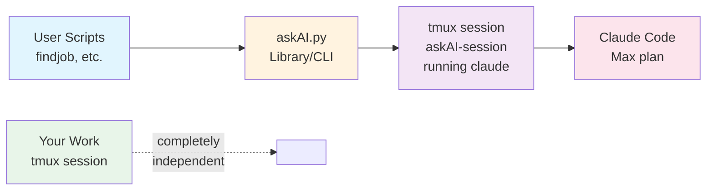

# askAI - Claude Code Automation via tmux

## Project Overview

 askAI is a system that creates a programmable API interface to Claude Code by running it in a dedicated tmux session. This allows scripts and automation tools to interact with Claude Code using your Claude Pro Max subscription, without needing to pay for API access.

## Problem Statement

- Claude Code (the CLI interface) provides powerful AI assistance using your Max plan
- The Anthropic API requires separate payment per token
- There's no official CLI that uses your Max plan benefits
- Scripts need to interact with Claude Code programmatically
- Manual interaction conflicts with automated scripts

## Solution Architecture



## Components

### 1. askAI.py (Python Library and CLI)
**Purpose**: Core Python module that can be used both as a library and command-line tool

**Features**:
- **Library Mode**: Import as `import askAI` in other Python programs
- **CLI Mode**: Execute with subcommands `askAI query "text"`
- **Symlink**: Available system-wide via symlink from ~/bin/askAI → /path/to/askAI.py

**Library Usage**:
```python
import askAI

# Simple query
response = askAI.query("What files are in this directory?")

# With options
response = askAI.query(
    prompt="Analyze this code",
    timeout=30,
    wait_for_ready=True
)

# Batch queries
responses = askAI.batch_query([
    "Find all Python files",
    "List their dependencies",
    "Check for security issues"
])
```

**CLI Usage**:
```bash
# Direct execution
python askAI.py "What is the current directory?"

# Via symlink from bin
askAI query "Search for TODO comments"

# With options
askAI --timeout 60 --verbose "Complex analysis task"

# Pipe input
echo "Explain this code" | askAI --stdin

# Output to file
askAI query "Generate documentation" > output.md
```

**Implementation Requirements**:
- Shebang line: `#!/usr/bin/env python3`
- Make executable: `chmod +x askAI.py`
- Create symlink: `ln -s /full/path/to/askAI.py ~/bin/askAI`
- Subcommand structure: `askAI <command> [options] [args]`
- Built-in setup function that runs on every execution:
  - Checks for and creates config file if missing
  - Validates Claude CLI availability
  - Validates tmux availability
  - Issues warnings for missing dependencies
- Configuration via YAML file only (no environment variables)
- Support both synchronous and asynchronous operations
- Provide context manager for session management
- Include proper error handling and logging

### 2. Session Management Commands
**Purpose**: The askAI script includes built-in commands to manage the tmux session

**Commands**:
- `askAI start` - Start the askAI tmux session
- `askAI stop` - Stop the session
- `askAI status` - Check if session is running
- `askAI attach` - Attach to session for debugging
- `askAI restart` - Restart the session
- `askAI logs` - Show recent activity

**Implementation Details**:
- Creates tmux session named "askAI-session"
- Starts Claude Code within the session
- Keeps session detached and running in background
- Provides health check and monitoring

### 2. askAI Integration with tmux
**Purpose**: The askAI.py module handles all client communication

**Usage**:
```bash
# All functionality now integrated into askAI.py
askAI query "What files are in the current directory?"
askAI --timeout 30 "Analyze this code and suggest improvements"
askAI --wait-for-ready "Find all Python files"
```

**Features**:
- Send prompts to the Claude session via tmux
- Wait for and capture Claude's response
- Handle multi-line responses
- Timeout handling
- Response validation
- Error handling

**Implementation Strategy**:
1. Check if askAI-session exists
2. Clear any pending output
3. Send prompt via `tmux send-keys`
4. Wait for Claude to start responding
5. Capture response via `tmux capture-pane`
6. Parse and return response
7. Handle errors and timeouts

### 3. Response Detection

**Challenge**: Knowing when Claude has finished responding

**Solutions to implement**:
1. **Prompt injection**: Add a unique end marker to prompts
2. **Output monitoring**: Watch for stability in output (no changes for X seconds)
3. **Pattern matching**: Look for Claude's typical response endings
4. **Activity detection**: Monitor pane activity via tmux

**Recommended approach**: Combination of output stability and pattern matching

## Example Client Script

### findjob Script Structure
```python
#!/usr/bin/env python3
import subprocess
import json

def query_claude(prompt):
    """Query Claude via askAI"""
    result = subprocess.run(
        ['askAI', prompt],
        capture_output=True,
        text=True,
        timeout=30
    )
    return result.stdout

# Step 1: Search for job
response = query_claude(f"Search for {job_title} at {company}")

# Step 2: Navigate to posting
response = query_claude("Click on the first relevant job posting")

# Step 3: Find application
response = query_claude("Find and click the Apply button")
```

## Setup Instructions

1. **Install requirements**:
   - Python 3.8+ installed
   - tmux must be installed
   - Claude Code CLI must be available

2. **Install askAI**:
   ```bash
   # Clone or download the askAI project
   cd /path/to/askAI

   # Make the Python file executable
   chmod +x askAI.py

   # Create symlink to bin directory
   ln -sf "$(pwd)/askAI.py" ~/bin/askAI

   # Or run the install script
   ./install.sh
   ```

3. **Start the API server**:
   ```bash
   askAI start
   ```

4. **Test the installation**:
   ```bash
   # Test CLI usage
   askAI query "Say hello"

   # Test Python library usage
   python3 -c "import askAI; print(askAI.query('What is 2+2?'))"
   ```

5. **Run example scripts**:
   ```bash
   # Using askAI as a library
   python3 examples/findjob.py "Google" "Machine Learning Engineer"

   # Using askAI from command line
   askAI query "Search for Python files in current directory"
   ```

## Advanced Features to Consider

### 1. Session Management
- Multiple Claude sessions for parallel processing
- Session pooling for heavy workloads
- Automatic session recovery on crash

### 2. Request Queue
- Queue multiple requests
- Process sequentially
- Return results asynchronously

### 3. Response Caching
- Cache common queries
- Reduce Claude usage
- Speed up repeated operations

### 4. Logging System
- Log all queries and responses
- Timestamp everything
- Create audit trail

### 5. Error Recovery
- Automatic restart on crash
- Retry failed queries
- Graceful degradation

## File Structure

```
askAI/
├── askAI.py            # Main Python library and CLI (executable)
├── install.sh          # Setup script for symlink creation
├── askAI.yaml          # Configuration file (YAML format)
├── logs/               # Query/response logs
│   └── askAI.log
├── examples/           # Example client scripts
│   ├── findjob.py
│   ├── analyze_code.py
│   └── search_docs.py
├── README.md           # Documentation
└── install.sh          # Setup script for symlink creation

~/bin/
└── askAI -> /full/path/to/askAI/askAI.py  # Symlink for system-wide access
```

## Configuration (askAI.yaml)

```yaml
# askAI Configuration

settings:
  session_name: askAI-session
  claude_command: claude
  default_timeout: 30
  log_level: INFO
  log_queries: true
  log_dir: ./logs
  response_end_marker: "<<<CLAUDE_END>>>"
  stability_wait: 2  # seconds to wait for output stability
  max_response_length: 10000
```

The configuration file uses a `settings` section to organize all parameters. This structure allows for future expansion with additional sections (e.g., `aliases`, `templates`, `hooks`).

## Testing Strategy

1. **Basic connectivity**: Can we start session and send commands?
2. **Response capture**: Can we reliably capture responses?
3. **Multi-line handling**: Do multi-line responses work?
4. **Error handling**: What happens when Claude errors?
5. **Timeout handling**: Do timeouts work correctly?
6. **Concurrent access**: Can multiple scripts query simultaneously?
7. **Session recovery**: Does it recover from crashes?

## Known Limitations

1. **Single session**: One Claude instance (could be extended to pool)
2. **Sequential processing**: Queries processed one at a time
3. **No context sharing**: Each query is independent
4. **Response detection**: May need tuning for reliability
5. **Max plan limits**: Subject to Claude Code rate limits

## Security Considerations

1. **Input sanitization**: Escape special characters in prompts
2. **tmux security**: Ensure session isn't accessible to other users
3. **Log privacy**: Sensitive data in queries should be handled carefully
4. **Process isolation**: Keep API session isolated from work session

## Future Enhancements

1. **Web interface**: HTTP API for remote access
2. **Response streaming**: Real-time response streaming
3. **Context management**: Maintain conversation context
4. **Load balancing**: Multiple Claude sessions
5. **Prometheus metrics**: Monitor usage and performance
6. **Docker container**: Containerized deployment

## Implementation Priority

1. ⬜ Create askAI.py with dual library/CLI functionality
2. ⬜ Implement session management commands in askAI.py
3. ⬜ Set up symlink from ~/bin/askAI to askAI.py
4. ⬜ Response detection reliability
5. ⬜ Error handling and recovery
6. ⬜ Logging system
7. ⬜ Configuration file support (askAI.yaml)
8. ⬜ Example Python scripts using askAI as library
9. ⬜ Documentation and install script
10. ⬜ Advanced features (async support, context management)

## Success Criteria

- Scripts can reliably query Claude Code
- No interference with manual Claude usage
- Responses captured accurately
- System remains stable over time
- Easy to use and debug

## Example Use Cases

1. **Job Application Finder**: Automatically navigate to job applications
2. **Code Analysis**: Batch analyze multiple code files
3. **Documentation Search**: Search and extract from documentation
4. **Test Generation**: Generate tests for code files
5. **Data Extraction**: Extract structured data from web pages
6. **Workflow Automation**: Complex multi-step automations

This system essentially turns Claude Code into a programmable service while leveraging your Max plan subscription.